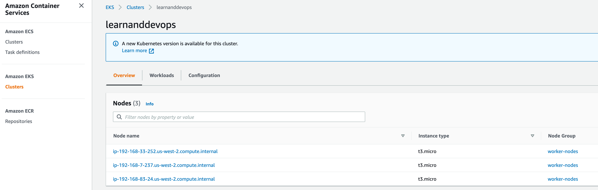
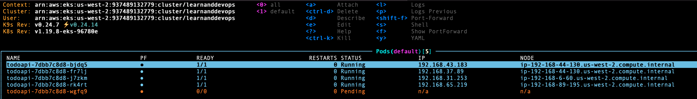
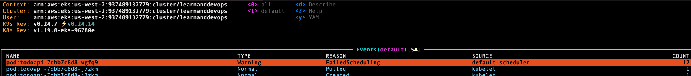

# Kubernetes "Lab" Exercise: Deploy a web api -- *continued from last week (and somewhat modified/extended)*

## Goals

* Pick up from where we left off last week (roughly [here](https://github.com/us-learn-and-devops/2021_07_07#5-scale-the-deployment), at part "5" of last week's lab).
* Understand liveness/readiness probes.
* Understand resource requests and limits... and go looking for trouble scaling beyond our means.
* Diagnose and solve an additional scaling limitation.
* Understand deployment strategies (e.g. "rollout") and deployment rollback.
* Understand how to troubleshoot a couple of (additional) failure scenarios... time allowing.
* Understand the k8s object/concept landscape at a high level, our roadmap through these for the next 10-12 sessions, and where we're at on that roadmap so far.

## Lab

(Warning: Since we bumped the Jul 14 meeting, some details of the following might end up changing by Jul 21 if I fiddle with it in the meantime.)

### 1. Setup

* Clone the `todoapi` project [here](https://github.com/us-learn-and-devops/2021_07_07/tree/master) (from last week) if you need to.
* Add AWS creds to your terminal session and start up your cluster. You can use the `cluster-deploy.sh` script if you like.
* Deploy the todoapi `deployment` and `service` from where we left off last week. You can use the `k8s/deploy.sh` script if you like.

### 2. Liveness and Readiness Probes

These are different kinds of health checks.

[Liveness probe](https://kubernetes.io/docs/tasks/configure-pod-container/configure-liveness-readiness-startup-probes): "The kubelet uses liveness probes to know when to restart a container. For example, liveness probes could catch a deadlock, where an application is running, but unable to make progress. Restarting a container in such a state can help to make the application more available despite bugs."

There are a few ways to define a liveness probe, but the most generally-used is an [HTTP GET request](https://kubernetes.io/docs/tasks/configure-pod-container/configure-liveness-readiness-startup-probes/#define-a-liveness-http-request) to an endpoint that should be guaranteed to return a 200 response unless the app server is unhealthy.

The todoapi has a root endpoint ("/") that sends a welcome message and default 200 response code that fits the bill. We can use that for a simple `httpGet` liveness probe.

* Add a `livenessProbe` config (`httpGet`) to the container spec for the todoapi container in your deployment.yaml, then rollout the update using `kubectl apply ...` again.
  * The path will be ___
  * The port will be ___
  * No headers are needed
  * Play with the initialDelaySeconds and periodSeconds settings.

[Readiness probe](https://kubernetes.io/docs/tasks/configure-pod-container/configure-liveness-readiness-startup-probes): "The kubelet uses readiness probes to know when a container is ready to start accepting traffic. A Pod is considered ready when all of its containers are ready. One use of this signal is to control which Pods are used as backends for Services. When a Pod is not ready, it is removed from Service load balancers."

The best way to understand the difference between a liveness vs a readiness probe is by the way k8s responds to each. The difference is not between what these two probes ***are***, but rather between how they are ***used***.

A failed liveness probe triggers a container restart: K8s assumes that its cause was a fatal error that can only be fixed by killing the container and trying to relaunch it.

A failed readiness probe merely causes k8s to "set aside" the container and stop sending it traffic: K8s assumes that the cause may be temporary and may self-heal after a bit.

The todoapi doesn't yet have a live DB connection, but when we upgrade it to have one (probably the session after our next session), a DB connection check would make a reasonable candidate for a readiness check.

Readiness probes [are configured](https://kubernetes.io/docs/tasks/configure-pod-container/configure-liveness-readiness-startup-probes/#define-readiness-probes) the same way as liveness probes, so for now we'll just copy our liveness probe as a readiness probe.

* Add a `readinessProbe` config (`httpGet`) to the container spec for the todoapi container in your deployment.yaml, then rollout the update using `kubectl apply ...` again.

### 3. Resources Requests & Limits

[Resources requests](https://kubernetes.io/docs/concepts/configuration/manage-resources-containers/#requests-and-limits): "When you create a Pod, the Kubernetes scheduler selects a node for the Pod to run on. The scheduler ensures that...the sum of the resource requests of the scheduled Containers is less than the capacity of the node."

I.e. your replicas are guaranteed by the scheduler to reserve the requested pod resources (memory or CPU) *if* you specify resources requests in the container spec.

* Scale your todoapi deployment to 4 replicas
  * Use the `spec.replicas` in your `deployment.yaml` and re-apply the config. (But you could also use kubectl directly: [See the docs](https://kubernetes.io/docs/concepts/workloads/controllers/deployment/#scaling-a-deployment))

We'll play a small game: See if you can use resources requests to over-allocate your worker nodes' available resources until the scheduler can no longer successfully support all of your replica pods.

Check out [this doc](https://kountinc.atlassian.net/wiki/spaces/KO/pages/8085409904/Kount+One+30+000+foot+view) on how k8s defines CPU and memory units for the resource requests. There's also a helpful example of how to add a request to a container spec. (Note that resource *limits* are a related but different topic... which we'll get to in a minute.)

* You can get an idea of what the resources requests are for [running containers](https://kubernetes.io/docs/concepts/configuration/manage-resources-containers/#resource-requests-and-limits-of-pod-and-container) in your cluster right now. That is pod information, so you ask kubectl for info about *pods* to get info on resources. This will show you a list for all running containers *if they have resource requests specified*: `kubectl get pods -o=jsonpath='{.items..resources.requests}' --all-namespaces`
* Note that all these are in the kube-system namespace, though: `kubectl get pods -o=jsonpath='{.items..resources.requests}' -n kube-system`
* If you run the same query for the "default" namespace where our todoapi containers are running, you get nothing: `kubectl get pods -o=jsonpath='{.items..resources.requests}' -n default`
  * That's because we haven't yet specified any resource requests for the todoapi containers, so they have none.
  * In other words, some of the pods running default k8s system services for the cluster care about, and specify, the resources that they need -- but we haven't bothered to do that yet for todoapi. Once we do, a `kubectl get pods...` query will list that info for our todoapi containers too.

You can *also* get an idea of how much worker-node resources you have available by checking out your cluster details.

There are 3 worker nodes (so far) that you can check out in your AWS web console:

* Click on one of these and take a look at its "Resource allocation" table. (The same, in fact more detailed, info is available from a `kubectl describe nodes {nodename}` command. See [here](https://kubernetes.io/docs/concepts/configuration/manage-resources-containers/#troubleshooting) for a troubleshooting example.)

Bear in mind that the worker nodes are supporting more than just your 4 todoapi containers, though. As you just saw, they're also running a handful of kube-system containers.
Also bear in mind that it's not *total* allocatable resources from all the worker nodes combined that you're interested in, but allocatable resources on any *one* given worker node that the scheduler can choose.

* Choose some CPU and memory numbers to start with for todoapi's resource requests. Then update the todoapi container spec in your deployment.yaml, and rollout the change.
* Then list or watch the todoapi pods using kubectl and see if the deployment rollout succeeds and you still have 4 replicas successfully getting scheduled. Note: It might take up to 2-3 minutes for the rollout to finish, so be patient.
  * If so, increase the CPU or memory request (or both) in the container spec again and re-rollout.
  * (BTW, note that if you describe a pod now, it will show the requests numbers.)
* Repeat until you've borked your deployment, then back it off again to a safe setting.

What does it look like when you bork your deployment? ([hint](https://managedkube.com/kubernetes/k8sbot/troubleshooting/pending/pod/2019/02/22/pending-pod.html))

* Describe one of the pods that couldn't launch. Check out the "Events". You should see a "Warning" "FailedScheduling" like this:

If resource requests are like asking for a car with enough horsepower to let you go at least 55 mph, resource *limits* are like setting up a 55 mph speed-limit zone to ensure that if you go over it, you'll face [consequences](https://kubernetes.io/docs/concepts/configuration/manage-resources-containers/#requests-and-limits):

"The runtime prevents the container from using more than the configured resource limit. For example: when a process in the container tries to consume more than the allowed amount of memory, the system kernel terminates the process that attempted the allocation, with an out of memory (OOM) error."

We won't experiment with limits today, but you can add one to your container spec following the example [here](https://kubernetes.io/docs/concepts/configuration/manage-resources-containers/#requests-and-limits).

### 4. Scaling Limitation and Deployment Rollout

* Your deployment's RelicaSet should now be scaled to 4 replicas. Before moving on...
  * Back the resource requests off to something very safe or get rid of them. We're going to focus on a different scaling limitation now.
  * Apply a meaningless change to your deployment: Change the `spec.templage.spec.containers` name to "todoapiv2". (This is a detail that will come in handy shortly. But you'll have to wait for it to become relevant: It doesn't have anything to do with the scaling we're trying to do right now.)
* Now try scaling to 5 replicas and watch or list the pods to see how the rollout is going. You should see the fifth pod get stuck in "pending" state.

That looks familiar given the resources overallocation experiment we just did, but why did it happen this time?

Let's ask kubectl:

* Try using `kubectl get events -n default`. Look for the most recent (of a probably repeating set) of FailedScheduling events.

If you look at the message for these events, you should see "0/3 nodes are available: 3 Too many pods."
That's similar to what we saw a few minutes ago, but no mention of CPU or memory issues.

* Try listing pods in *all* [namespaces](https://kubernetes.io/docs/concepts/overview/working-with-objects/namespaces/). (Refer to the [kubectl cheatsheet](https://kubernetes.io/docs/reference/kubectl/cheatsheet/#viewing-finding-resources) if you need to.)
* Count the number of ***running*** pods (not counting the one stuck in pending state).
* Now list the cluster's worker nodes (`kubectl get nodes`) and `describe` one of them using kubectl. (Or you could check out the worker-node details in the EKS web console.) See if you can find a clue there about why our 5th replica is getting stuck in "pending".
* Here's another hint: <https://github.com/awslabs/amazon-eks-ami/blob/master/files/eni-max-pods.txt>

What *is* happening with that stuck pod?

OK. Assuming we've now understood the problem, how can we fix it?

Here's one way to try. It's doomed in this particular case, but it will give us an opportunity to further investigate the way a deployment rollout works:

The todoapi pods belong to a `deployment`, and the whole point of a `deployment` is that it's a `replicaSet` that has a deployment "strategy", like "rollout".

We've seen rollout in action while updating our deployment earlier.

We haven't specified a deployment strategy, so we're getting the default rollout strategy with its default settings.

* Describe the deployment. You should see "RollingUpdateStrategy:  25% max unavailable, 25% max surge". This corresponds to adding a `spec.strategy` like the following to our deployment.yaml:

      rollingUpdate:
        maxSurge: 25%
        maxUnavailable: 25%
      type: RollingUpdate

(Note that you can also choose a non-default "Recreate" deployment strategy that terminates *all* pods in the replicaSet before deploying their replacements: I.e. you get a momentary service interruption. RollingUpdate is specifically designed to avoid that.)

Kubernetes docs don't say much about rolling update config -- probably because they don't expect folks to fiddle too much with the default settings -- but you can find some info [here](https://www.bluematador.com/blog/kubernetes-deployments-rolling-update-configuration).

* You can use a rollout command to view the history of our deployment's rolling updates: `kubectl rollout history deployment todoapi`
* You can also view the status of the current rollout: `kubectl rollout status deployment todoapi`. Right now this should say "Waiting for deployment "todoapi" rollout to finish: 4 out of 5 new replicas have been updated..." because we're still stuck with that 5th pod unable to be scheduled.

Because we made that little container-name change in our deployment spec, we should *have* a rollout history with more than one item in it even if you didn't do the resources requests/limitations experiments above. (Scaling updates alone don't count in rollout history.)

That means that we should be able to roll back the deployment using a `rollout undo` command:

* Try `kubectl rollout undo deployment todoapi`. You should get a success message... and ordinarily this would work. But we've still got a problem to solve.
* List/watch your pods again and see what's happening. You should see that the situation is now worse than before!

(The problem is that rollback will try to replay the previous successful rollout in the deployment's rollout history. Describe the deployment and check its "events" log to understand what has happened.)

The real problem is that we're simply too close to our limits on these nodes to be able to rollback: There's not enough room.

We can manually scale our worker-node node group, however.

* Go back to the EKS service in your AWS web console. Find your EKS cluster and edit the "worker-nodes" node group: Update the "Desired size" to 4 nodes instead of 3.
* It will take a few minutes for the cluster update to happen, but once you see the 4th worker node is "ready", go back to kubectl and describe the deployment again. Check out the "events" log and you should see that the stuck deployment has finally been able to finish.
* Note also that the "events" log shows how k8s is applying the default rollout strategy.

### 5. Additional Failure Scenarios

* What happens if a deployment can't launch pods at all?
  * Sabotage your deployment config file by misspelling the image name. Try a redeploy.
  * What happens? How might you be likely to encounter this kind of failure "in the wild"?
* What happens if a liveness probe fails?
  * Sabotage your deployment config file to induce this failure scenario.
  * What happens? How might you be likely to encounter this kind of failure "in the wild"?

### 6. Learn&DevOps K8s Roadmap

| k8s object/concept                            |            | exercise/demo                               | tentative date |
| --------------------------------------------- | ---------- | ------------------------------------------- | -------------- |
| pod                                           | (k8s core) |                                             | (This is       |
| replica set                                   | (k8s core) |                                             | what we're     |
| deployment                                    | (k8s core) |                                             | covering now.) |
| service & endpoints                           | (k8s core) |                                             |                |
|                                               |            |                                             |                |
| labels                                        |            | * Add multiple                              | Jul 28         |
| namespaces                                    |            | environments to                             |                |
| config maps                                   |            | todoapi deployment                          |                |
| ingress/controller                            |            | * Add ingress to todoapi                    |                |
|                                               |            |                                             |                |
| secrets                                       |            | * Add DB to todoapi                         | Aug 04         |
|                                               |            | * Add TLS to todoapi                        |                |
|                                               |            | * Add private Docker repo to todoapi        |                |
| service-to-service comm'n                     |            | * Add additional services to todoapi envs   |                |
|                                               |            |                                             |                |
|                                               | <--------- | "class" exercise --------->                 | Aug 11         |
|                                               |            |                                             |                |
|                                               |            | (no meeting)                                | Aug 18         |
|                                               |            | (no meeting)                                | Aug 25         |
|                                               |            |                                             |                |
| daemon sets                                   |            | * Add logging/metrics to nodes              | Sep 01         |
| logging, metrics                              |            |                                             |                |
|                                               |            |                                             |                |
| pod autoscaling                               |            | * Add autoscaling config                    | Sep 08         |
| node autoscaling                              |            |                                             |                |
|                                               |            |                                             |                |
|                                               | <--------- | "class" exercise --------->                 | Sep 15         |
|                                               |            |                                             |                |
| jobs, cronjobs                                |            | * Add cronjob and data backup for todo data | Sep 22         |
| volume claims                                 |            |                                             |                |
|                                               |            |                                             |                |
| helm                                          |            | * Add helm chart and real deploy pipeline   | Sep 29         |
| CI/CD                                         |            |                                             |                |
|                                               |            |                                             |                |
|                                               | <--------- | "class" exercise --------->                 | Oct 06         |
|                                               |            |                                             |                |
| Additional topics survey, e.g. service mesh ? |            | -                                           | Oct 13         |
